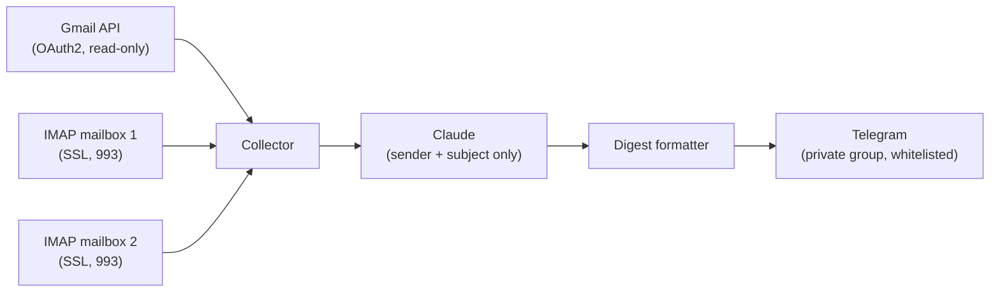
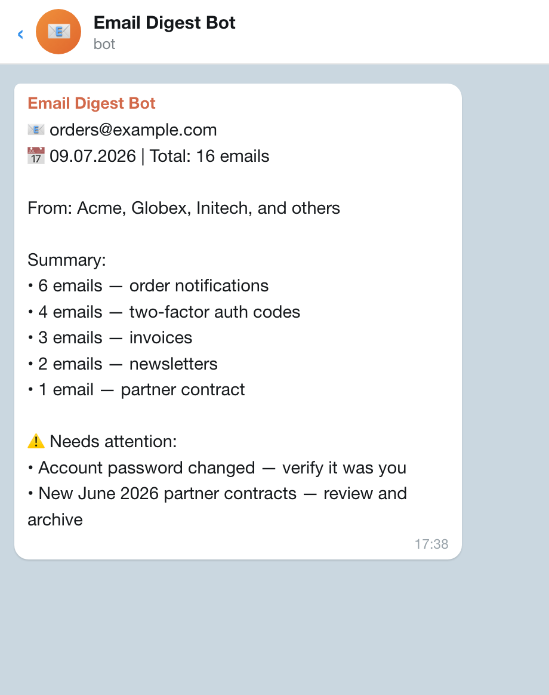

# Email Morning Digest

A small automation that reads several mailboxes every morning, uses an LLM to
categorize the incoming mail, and delivers a short, human-readable digest to a
private Telegram group — so a busy inbox becomes a 30-second read instead of a
100-email scroll.

> **Note:** This is an anonymized demo version of a tool running in production.
> All mailboxes, company names, and identifiers have been replaced with
> `example.com` placeholders and fictional companies (Acme, Globex, Initech).

---

## Why it exists

An operations owner was receiving 100+ emails a day across three mailboxes
(orders, support, and a general inbox). Most of it was routine — order
confirmations, SMS-gateway receipts, newsletters — but a few messages every day
genuinely needed action: overdue invoices, pricing-policy violations, documents
to sign. Reading everything manually did not scale.

This bot does the triage: it groups the noise, surfaces the few items that
matter, and posts one message per mailbox at 8:00.

---

## How it works



1. **Collect** — pulls yesterday's inbox messages from one Gmail account (via the
   Gmail API with a read-only OAuth2 scope) and two IMAP mailboxes (SSL on port
   993). On Mondays it covers the whole weekend (Sat + Sun) instead of a single
   day.
2. **Analyze** — sends only the `sender + subject` of each email to Claude
   (`claude-haiku-4-5`). Bodies are never sent, which keeps token usage low and
   avoids exposing message content to the model.
3. **Format** — Claude returns a plain-text digest: a list of senders, a grouped
   summary ("28 emails — B2B orders"), and a short "Needs attention" block.
4. **Deliver** — posts one message per mailbox to a private Telegram group.

---

## Example output

What the daily digest looks like in Telegram (sample data):



<details>
<summary>Same output as text</summary>

```
📧 orders@example.com
📅 09.07.2026 | Total: 101 emails

From: Acme, Globex, Initech, and others

Summary:
• 28 emails — B2B orders
• 15 emails — SMS gateway notifications
• 12 emails — invoices and receipts
• 9 emails — newsletters

⚠️ Needs attention:
• Pricing-policy violation (Initech) — fix listed prices
• Overdue invoice #4471 (Acme) — €1,240, due yesterday
```

</details>

---

## Design decisions worth noting

| Decision | Why |
|----------|-----|
| Send only `sender + subject` to the LLM | Keeps cost low and never exposes email bodies to a third-party model |
| Read-only Gmail OAuth scope | The bot can never modify or delete mail |
| Telegram `chat_id` whitelist in code | Even if config is tampered with, the digest can only go to approved chats |
| Plain text, no Markdown `parse_mode` | A stray `*` in a subject line can't break message rendering |
| Monday = weekend catch-up | No gap in coverage after non-working days |
| All secrets in `.env` | Nothing sensitive is ever committed (see `.gitignore`) |

---

## Setup

```bash
# 1. Install dependencies
pip install -r requirements.txt

# 2. Configure secrets
cp .env.example .env
#    ...then fill in the values

# 3. For the Gmail account, place Google OAuth client secrets as credentials.json
#    (first run opens a browser once to authorize; the token is cached locally)

# 4. Run
python3 digest.py
```

Scheduling is left to the host (e.g. `cron` / `launchd` / GitHub Actions) — run
`digest.py` once every morning.

---

## Tech stack

- **Python 3.10+**
- **Gmail API** (`google-api-python-client`, OAuth2)
- **IMAP** (`imaplib`, SSL/993)
- **Anthropic Claude** (`anthropic` SDK, `claude-haiku-4-5`)
- **Telegram Bot API** (`httpx`)

---

## Security notes

- No secrets in the repository — `.env`, OAuth tokens (`*.pickle`), and
  `credentials.json` are git-ignored.
- The Gmail scope is read-only.
- Telegram delivery is restricted to a whitelisted chat id.
